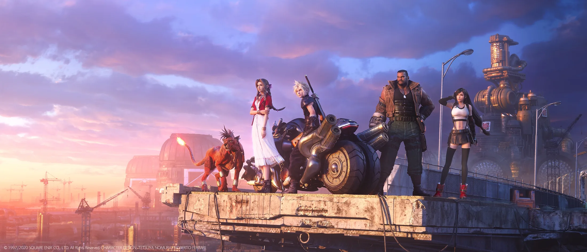

<p align="center">
  
  <br>
  <sub><i>Final Fantasy VII Remake</i> key art © Square Enix</sub>
</p>

<h1 align="center">FINAL FANTASY VII · TIMELINE ANALYZER</h1>

<p align="center"><b>One story. Four tellings.</b></p>

<p align="center">
  
  
  
  
  
</p>

A fan-made guide to how _Final Fantasy VII_'s story is told across the 1997 original, _Remake_, _INTERmission_ and _Rebirth_: what each game shows, what changes, how everyone is connected, and where the stories part ways. It's written for someone meeting the story for the first time, and every fact says where in the game to see it.

---

## ☞ The party

The four games, as the home menu shows them.

| Game                                                   | LV   | What the archive holds                                      |
| ------------------------------------------------------ | ---- | ----------------------------------------------------------- |
| **Final Fantasy VII**                                  | 1997 | The whole original story: 39 parts on 3 discs               |
| **Final Fantasy VII Remake**                           | 2020 | 18 chapters, from Mako Reactor 1 to Shinra HQ               |
| **Final Fantasy VII Remake Intergrade — INTERmission** | 2021 | Yuffie's 2 chapters: a new story beside the first           |
| **Final Fantasy VII Rebirth**                          | 2024 | 14 chapters and an interlude, Kalm to the Forgotten Capital |

61 characters, moments, places and groups · 171 appearances · 148 links — each checked against the games themselves.

## ☞ Commands

| Command        | What you'll find                                                                         |
| -------------- | ---------------------------------------------------------------------------------------- |
| **Timeline**   | The story top to bottom in chapters; tap a moment for how each game tells it             |
| **Compare**    | What changes between two games, moment by moment, or anything side by side               |
| **Divergence** | A turning point: the story so far on a line of Mako light, then where each game goes     |
| **Network**    | A web of materia — people, moments, places, groups — and the chain that links any two    |
| **Explore**    | Who's who and what's what, as picture cards                                              |
| **Archive**    | Each game chapter by chapter, and how every fact was checked                             |
| **Config**     | Background music, motion, the title screen, the Buster Sword cursor, the spoiler warning |

Around it: a title screen over Midgar at night, a home menu in the original's pause-menu style that you can drive with the arrows or W A S D, the original's blue window between sections, and 103 official pictures behind every screen. The full look is in [`docs/design.md`](docs/design.md).

## ☞ Materia

| Slot     | Equipped                                                                                          |
| -------- | ------------------------------------------------------------------------------------------------- |
| Web      | React 19, Vite, React Router, Tailwind CSS, TanStack Query, Zustand, Cytoscape                    |
| API      | Fastify, Zod, OpenAPI                                                                             |
| Data     | Hand-written YAML in [`data/`](data/) — the source of truth — seeded into PostgreSQL with Drizzle |
| Tests    | Vitest, Playwright, axe-core                                                                      |
| Language | TypeScript throughout, run natively on Node 24, in a pnpm monorepo                                |

## ☞ Save point

Needs Node 24, pnpm and Docker.

```bash
pnpm install
cp .env.example .env
pnpm db:up && pnpm db:migrate && pnpm db:seed
pnpm api:dev    # http://localhost:3000/docs
pnpm web:dev    # http://localhost:5173
```

| Command         | What it does                                                            |
| --------------- | ----------------------------------------------------------------------- |
| `pnpm check`    | Types, lint, format, unit tests and data validation                     |
| `pnpm test:db`  | Database and API tests (after `pnpm db:up`)                             |
| `pnpm e2e`      | Build the site and run the Playwright journeys and accessibility audits |
| `pnpm web:size` | Keep the first load under its size budgets                              |
| `pnpm validate` | Check `data/` against every rule in the docs                            |
| `pnpm db:reset` | Rebuild the database from scratch                                       |

After changing the API, run `pnpm api:types`; after a schema change, `pnpm db:generate`; after a Zod schema change, `pnpm schemas`.

## ☞ The map

```
apps/
  web/          the site
  api/          read-only REST API
  e2e/          Playwright journeys and axe audits
packages/
  shared/       schemas, titles, chronology, statuses, divergence
  data/         loads and validates data/
  db/           PostgreSQL schema, seeding and queries
  graph-core/   paths, groups and centrality for the network
data/           every fact, as YAML, with the research log
docs/           the model, the design and the decisions
```

## ☞ How the facts are checked

Each game is its own canon. A fact goes in only once it's been checked against the game — by playing it, from video of it, or from its script — and it carries where to see it. Fan wikis are used only to find things, never as proof. Anything a game leaves open is marked as such, never settled with a guess. Every source and open question is listed in the app at `/archive/research`; the rules are in [`docs/`](docs/README.md).

## ☞ Credits

- **Final Fantasy VII**, its names, characters and artwork belong to **Square Enix**. Every image is official Square Enix material, credited on the site's Credits page: artwork, plus a few stills, promo shots and one fan render of a game model for moments, places and groups no artwork shows. None is AI-made, and any will be removed at the rights holder's request.
- **Lettering:** the series' logo lettering by Juan Pablo Reyes Altamirano, Optimus Princeps by Manfred Klein, [Reactor7](https://caveras.net/) by Caveras (CC BY-NC-SA, licence in `apps/web/public/fonts/reactor7/`), Inter and JetBrains Mono.
- **Cursor:** Cloud's Buster Sword from [Cursors-4U](https://www.cursors-4u.com/cursor/final-fantasy-7-cloud-s-buster-sword).

## ☞ Licence

- **Code:** [MIT](LICENSE).
- **Data and docs** (`data/`, `docs/`): [CC BY-NC 4.0](LICENSE-DATA) — reuse with credit, not for profit.

These cover only the original work here, not Square Enix's.

<p align="center"><sub>A non-commercial fan project. Not affiliated with or endorsed by Square Enix.</sub></p>
